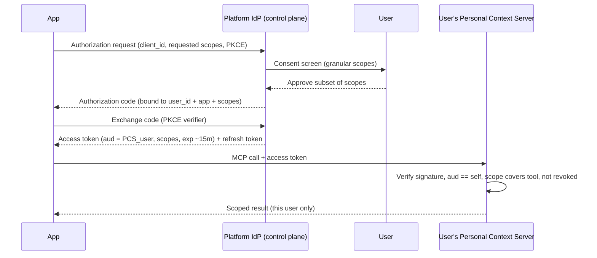

# The Ring — Marketplace & SDK Platform Architecture

**Status:** RFC / Draft
**Owners:** Platform & Security
**Scope:** Third-party developer SDK, app runtime, and the per-user data isolation model for the personal context layer exposed over MCP.

---

## 1. Overview & Goals

The Ring fuses always-on ambient voice capture, passive biometrics, motion, location, and intentional voice into a single **personal context layer**, unified on-device and exposed over the **Model Context Protocol (MCP)**. The marketplace opens that layer to third-party developers so they can build apps ("extensions") that operate on a user's own context — drafting distribution, surfacing insights, routing thoughts to the right destination — without us building every feature ourselves.

### What the SDK enables

- Build apps that read a user's captured thoughts, biometrics, motion, location, activity, projects/backlog/metrics, and writing "voice."
- Build apps that *act*: draft a tweet in the user's voice, file a ticket, write a changelog, push a TODO, add a new distribution destination.
- React to events ("new capture," "distribution requested") scoped to a single user.
- Ship to a marketplace others can install.

### The non-negotiable invariant

> **An app instance only ever sees the data of the single user who installed it.**
> Cross-user data access must be *structurally impossible*, not merely *policy-forbidden*. There is no API surface, token, or query path that resolves to more than one user's partition.

### Design principles

| Principle | Meaning |
|---|---|
| **Local-first** | Raw context lives on the user's device (ring + phone). The cloud is optional and never the system of record for raw PII. |
| **Least privilege** | Apps declare narrow capability scopes; users grant granularly; tokens are short-lived and audience-bound. |
| **Brokered access only** | No app touches the raw data store. All access flows through scoped MCP tools. |
| **Isolation by construction** | One MCP server instance per user identity. An app's credential cryptographically resolves to exactly one server. |
| **Revocable & auditable** | Every grant is revocable; every access is logged in a user-visible audit trail. |

---

## 2. High-Level Architecture

### 2.1 Layers

```mermaid
flowchart TB
    subgraph Ring["Ring (capture device)"]
        MIC[Mic / ambient capture]
        BIO[Biometric + motion sensors]
    end

    subgraph Phone["Phone / Companion App (user's device) — local-first"]
        INGEST[Ingest + on-device ML\ntranscription, embeddings, derivation]
        STORE[(Per-user encrypted\ncontext store)]
        MCP[Personal MCP Server\n(one instance, bound to user identity)]
        BROKER[Capability Broker\nscope + audience enforcement]
        SANDBOX[Third-party App Sandbox\nWASM / isolated process]
        CONSENT[Consent + Audit UI]
    end

    subgraph Cloud["Platform Cloud (control plane, no raw PII)"]
        REG[App Registry + Review]
        IDP[Identity Provider / OAuth2-OIDC]
        AGG[Privacy-preserving Aggregation\n(opt-in only)]
    end

    subgraph DevCloud["Developer Cloud (optional, per-app)"]
        DBE[Developer backend\n(per-user tokens only)]
    end

    MIC --> INGEST
    BIO --> INGEST
    INGEST --> STORE
    STORE --> MCP
    MCP --> BROKER
    BROKER --> SANDBOX
    SANDBOX -. brokered egress .-> DBE
    IDP --- BROKER
    REG --- SANDBOX
    CONSENT --- BROKER
    AGG -. opt-in, DP only .- INGEST
```

- **Ring** captures audio and sensor streams; does minimal processing; ships to the paired phone over an encrypted BLE link.
- **Phone/App** is the heart of the system. It runs on-device ML (transcription, embeddings, signal derivation), holds the **per-user encrypted context store**, runs the **Personal MCP Server**, the **Capability Broker**, and the **third-party app sandbox**.
- **Platform Cloud** is a *control plane only*: app registry/review, identity/consent issuance, and an opt-in privacy-preserving aggregation service. It never holds raw context.
- **Developer Cloud** is optional and per-app. If a developer needs a backend, it only ever receives data scoped to one user via that user's token — never a pool.

### 2.2 Where data lives, where code runs

| Concern | Location |
|---|---|
| Raw audio, transcripts, biometrics, location, derived context | **On device**, per-user encrypted store. System of record. |
| Third-party app code execution | **On device** in a sandbox (default), or a developer cloud (optional, token-scoped). |
| App identity / consent issuance | Platform cloud (control plane). |
| Cross-user analytics | Only via opt-in differential-privacy aggregation; raw PII never leaves device. |

### 2.3 Two execution models

**(a) App as MCP client → user's Personal MCP Server.**
The app is code (on-device sandboxed, or in the developer's cloud) that holds a per-(user, app) OAuth token and connects as an **MCP client** to *that user's* Personal MCP Server. Data stays on device; the app receives only the results of scoped tool calls. The MCP server is the single chokepoint.

**(b) App as sandboxed on-device code with a capability-scoped local API.**
The app's code is loaded into a WASM/process sandbox and calls a host-provided capability API directly. Strong locality, but the isolation boundary is the sandbox host API surface, which is broader and bespoke.

### 2.4 Recommendation: **MCP-centric (model a), with on-device sandboxing as the runtime for trusted/local apps**

We adopt **(a)** as the primary architecture and use the **(b)** sandbox as the *execution environment* for apps that run on-device. The two compose: an on-device sandboxed app is still an MCP client speaking to the local Personal MCP Server through the broker.

Why MCP-centric naturally enforces per-user isolation:

1. **One MCP server instance per user.** Each user's context is fronted by a logically distinct MCP server bound to that user's identity and encryption keys. There is no "global" server.
2. **An app instance is provisioned per user-install.** Installing app *X* for user *A* mints a credential whose **audience is A's MCP server only**. The same app installed by user *B* gets a *different* credential bound to *B's* server.
3. **No multiplexing.** The MCP server never serves more than one user's partition. A token presented to A's server that was minted for B fails audience validation before any tool executes.
4. **The developer never gets a "query all users" surface.** There is no endpoint that spans partitions. Cross-user access would require holding N distinct per-user tokens *and* N distinct consents — and even then each token reaches exactly one partition, returning that user's data only to that user's install context.

This converts the isolation guarantee from a policy ("don't read other users") into a property of the topology (there is no wire to other users).

---

## 3. Per-User Data Isolation — The Security Model

This is the core of the document.

### 3.1 The isolation boundary: per-user MCP server instance

Each user *U* has a **Personal Context Server (PCS)** — a logical MCP server instance:

- Bound to `U`'s stable **user identity** (`user_id`, a public key / DID).
- Bound to `U`'s **per-user data encryption key** (`DEK_U`), which gates the only copy of `U`'s decryptable data.
- Addressable only via an endpoint derived from `U`'s identity (on-device: a local IPC channel namespaced to `U`; in cloud-hosted deployments: a per-tenant endpoint + mTLS identity).

```
PCS_U  ──owns──▶  Store_U  (encrypted with DEK_U)
   │
   └── accepts only tokens with aud = PCS_U
```

There is **no** server that owns more than one `Store`. Partitioning is physical at the key level: `Store_A` is encrypted with `DEK_A`, `Store_B` with `DEK_B`, and no component holds both in a way an app can reach.

### 3.2 Identity & auth

We use an OAuth2 / OIDC-style flow with three parties: the **user** (resource owner), the **app** (client), and the **platform IdP** (authorization server). The PCS is the resource server.

**Consent / authorization flow:**



**Token properties (the crux of cross-user safety):**

- **Audience binding.** Every access token carries `aud = PCS_<user_id>`. The PCS rejects any token whose audience is not itself. A token minted for user A is **cryptographically useless** against user B's PCS: B's server only accepts `aud = PCS_B`, and A's token says `aud = PCS_A`, signed by the IdP. The app cannot forge it.
- **Subject binding.** `sub = user_id`. The token *is* the user binding; there is no separate "which user?" parameter an app could tamper with.
- **Short-lived + scoped.** Access tokens expire in ~15 minutes; refresh requires the long-lived consent to still be valid (not revoked). Scopes are embedded and enforced per-tool.
- **Sender-constrained.** Tokens are bound to the client via DPoP / mTLS (proof-of-possession), so a stolen bearer token cannot be replayed by another party.
- **Per-(user, app) granularity.** The (user, app, scope-set) triple is the unit. Installing the same app twice (two users) yields two unrelated credentials reaching two unrelated servers.

Example access-token claims:

```json
{
  "iss": "https://id.ring.platform",
  "sub": "user_8f3a...",
  "aud": "pcs://user_8f3a...",
  "client_id": "app_threadsmith",
  "scope": "captures:read biometrics:latest distribution:draft",
  "cnf": { "jkt": "0ZcOCORZ..." },
  "iat": 1750100000,
  "exp": 1750100900,
  "install_id": "inst_a91c..."
}
```

### 3.3 Capability-scoped permissions (least privilege)

Access is gated by fine-grained scopes mapped to MCP tools/resources. Examples:

| Scope | Grants |
|---|---|
| `captures:read` | Read transcribed voice thoughts (full text). |
| `captures:search` | Semantic/keyword search over captures (no bulk export). |
| `biometrics:latest` | Latest biometric snapshot (HR, HRV). |
| `biometrics:history` | Historical biometric series. |
| `location:coarse` | City-level location. |
| `location:precise` | GPS-precision location. |
| `motion:activity` | Activity classification (walking, typing). |
| `context:projects` | Projects / backlog / metrics. |
| `voice:style` | The user's writing-voice model (for drafting). |
| `distribution:draft` | Create *drafts* of outputs (no auto-publish). |
| `distribution:publish` | Publish to a connected destination (separate, sensitive). |
| `events:subscribe` | Receive scoped webhooks/events. |

Rules:
- **Default deny.** A tool call fails unless the presented token's scope set covers it.
- **Granular consent.** The user sees and can approve a *subset* of requested scopes.
- **Separation of read vs. write vs. publish.** Drafting is low-risk; publishing externally is a distinct, higher-friction grant.
- **Revocable per-scope.** The user can revoke any single scope; the next refresh fails for that capability.

### 3.4 Why there is structurally no cross-user query path

- **Physical partition per user.** `Store_U` is a separate encrypted partition; on multi-user cloud-hosted deployments, this is enforced as separate tenants and/or row-level security keyed by `user_id` with the key derived from the request's verified `sub` — never from app-supplied input.
- **No global resource server.** Every MCP endpoint is a PCS bound to one user. The platform exposes no "list users," "query across," or admin-impersonation surface to developers.
- **Credential → exactly one partition.** A token resolves to `sub`/`aud`; `aud` selects the server; the server only holds one `Store`. The app cannot name another user in any call — there is no `user_id` parameter in any tool. Identity comes *only* from the verified token.
- **Egress brokering.** Even if an app obtains data for user A, it cannot silently combine A's and B's data, because acquiring B's data requires B's separate install + consent + token, and the egress broker (§3.6) tags and rate-limits per-install outflows.

> The strongest statement we can make: an honest implementation **cannot** be made to leak across users by misconfiguration of an app, because no per-app configuration ever names a user. The user is the token.

### 3.5 Encryption & key custody

- **Per-user DEK.** Each `Store_U` is encrypted at rest with a per-user data encryption key `DEK_U`.
- **Key hierarchy.** `DEK_U` is wrapped by a key derived from the device secure enclave / hardware keystore (Secure Enclave / StrongBox / TEE). Keys never leave hardware in plaintext.
- **Local-first by default.** Because raw data lives on the user's device, the device enclave is the root of trust; no platform server can decrypt `Store_U`.
- **E2E for cloud sync.** Optional cross-device sync is end-to-end encrypted; the platform stores only ciphertext it cannot read.
- **Apps never see keys.** Apps receive *tool results*, never the DEK and never the raw store. Decryption happens inside the PCS, behind the broker, after scope/audience checks.
- **Ring link.** Ring→phone transport uses an authenticated, encrypted BLE channel with rotating session keys.

### 3.6 Sandboxing of third-party code

On-device apps run in a sandbox; cloud apps run in the developer's environment but are equally constrained by the broker.

- **Isolation.** WASM modules (or OS-isolated processes) with no ambient authority. No shared memory with other apps or the host store.
- **No raw filesystem / network.** The sandbox has *no* direct FS or socket access. All I/O is via host-brokered, scoped capabilities.
- **Brokered MCP only.** The only channel to user data is the Capability Broker, which injects the per-install token and enforces scope on every call.
- **Egress controls.** Outbound network is allowlisted per app manifest (declared domains), brokered, rate-limited, and tagged with `install_id`. This prevents an app from exfiltrating one user's data to combine with another's, and makes bulk-exfiltration anomalies detectable.
- **No cross-install state.** Each install gets an isolated storage namespace; one user's app instance cannot read another install's cached state.
- **CPU/memory/time quotas.** Per-install resource budgets prevent abuse.

### 3.7 Aggregate / analytics (kept strictly separate)

Cross-user insight is a *different system* from per-user app access:

- **Opt-in only**, per user, per metric, separate consent from app scopes.
- **No raw PII leaves the device.** Aggregation is computed via **on-device local computation + differential privacy** (e.g., randomized response / DP-SGD style noise / secure aggregation), so the platform receives only noised aggregates.
- **No developer access to the raw aggregation inputs.** Developers receive only published, privacy-budget-bounded aggregates.
- This path is firewalled from the MCP app-access path: an app's per-user token can *never* reach aggregate raw data, and the aggregation pipeline holds no per-app credentials.

---

## 4. The SDK

### 4.1 App manifest

Declarative; reviewed at submission; defines the entire trust surface.

```json
{
  "id": "app_threadsmith",
  "name": "Threadsmith",
  "version": "1.4.0",
  "publisher": { "id": "pub_92a1", "name": "Threadsmith Labs" },
  "runtime": "wasm-on-device",            // or "developer-cloud"
  "scopes": [
    "captures:search",
    "voice:style",
    "distribution:draft",
    "events:subscribe"
  ],
  "mcp": {
    "tools": ["ring.captures.search", "ring.voice.style.get", "ring.distribution.draft"],
    "resources": ["ring://captures", "ring://voice-profile"]
  },
  "events": [
    { "type": "capture.created", "scope": "captures:search" }
  ],
  "egress": { "allowlist": ["api.x.com"] },   // only if runtime needs external publish
  "ui": {
    "surfaces": ["capture-detail-action", "settings-pane"],
    "entry": "ui/index.wasm"
  },
  "distribution": {
    "destinations": [
      { "id": "x-thread", "label": "X Thread", "scope": "distribution:publish" }
    ]
  }
}
```

### 4.2 Client init & per-install authentication

The SDK abstracts the OAuth/PKCE + DPoP dance. An app authenticates as *this install for this user* — it never names a user.

```typescript
import { RingApp } from "@ring/sdk";

// The SDK obtains/refreshes the per-(user, app) token bound to this install.
// `installContext` is injected by the platform at launch; the app cannot fabricate it.
const ring = await RingApp.connect({
  clientId: "app_threadsmith",
  installContext: platform.installContext, // opaque; resolves to exactly one PCS
  // DPoP key generated/held in-sandbox; token is sender-constrained
});

// Identity is implicit. There is no user_id parameter anywhere.
```

### 4.3 Reading the user's context via MCP tools

```typescript
// Search the installing user's captures (requires captures:search)
const hits = await ring.tools.call("ring.captures.search", {
  query: "ideas about the onboarding flow",
  limit: 10,
  since: "2026-06-01"
});

// Latest biometrics (requires biometrics:latest)
const bio = await ring.tools.call("ring.biometrics.latest", {});
// => { heartRate: 62, hrv: 48, capturedAt: "2026-06-17T14:02:00Z" }

// Draft distribution in the user's voice (requires voice:style + distribution:draft)
const draft = await ring.tools.call("ring.distribution.draft", {
  destination: "x-thread",
  source: { captureId: hits[0].id },
  style: "user-voice"
});
// draft is a DRAFT object; publishing requires distribution:publish + user action
```

All of these resolve to the installing user only — the PCS the token's `aud` points at. No tool accepts a user identifier.

### 4.4 Requesting consent (incremental)

```typescript
// App may run with minimal scopes, then request more on demand.
const granted = await ring.consent.request({
  scopes: ["distribution:publish"],
  reason: "Publish your drafted thread directly to X"
});
if (granted.includes("distribution:publish")) {
  await ring.tools.call("ring.distribution.publish", { draftId: draft.id });
}
```

### 4.5 Local data access goes only through brokered MCP

There is **no** `@ring/sdk` API for direct DB/file/store access. The SDK exposes:
- `ring.tools.call(...)` — invoke a scoped MCP tool.
- `ring.resources.read(uri)` — read a scoped MCP resource.
- `ring.consent.*`, `ring.events.*`, `ring.storage.*` (per-install sandboxed scratch only).

Any attempt to reach the store directly fails: the sandbox has no FS/socket authority (§3.6).

### 4.6 Webhooks / events (per-user scoped)

```typescript
ring.events.on("capture.created", async (evt) => {
  // evt is for THIS install's user only. Delivered with a fresh scoped token.
  // evt = { type, captureId, at, installId }  -- no raw cross-user data, no other users
  const capture = await ring.tools.call("ring.captures.get", { id: evt.captureId });
  // ...react
});
```

For cloud-runtime apps, webhooks are delivered to the developer endpoint signed (HMAC) and carrying only `install_id` + minimal payload; fetching content still requires the per-install token. One delivery = one user.

### 4.7 Distribution apps — adding a new destination

A distribution app declares destinations in its manifest and implements a draft/publish contract:

```typescript
export default defineDistribution({
  id: "x-thread",
  label: "X Thread",
  // Produce a draft from a source capture/thought
  async draft({ source, voiceProfile }) {
    return { blocks: splitIntoTweets(source.text, voiceProfile) };
  },
  // Publish requires distribution:publish + an explicit user action
  async publish({ draft, connection }) {
    return await postThread(connection, draft.blocks); // egress allowlisted
  }
});
```

New output types become first-class targets in the user's "say it once, route it everywhere" flow — gated by `distribution:draft` / `distribution:publish`.

---

## 5. Consent & Permissions UX

- **Install flow.** User taps Install → sees publisher identity, app version, and a **plain-language scope list** grouped by sensitivity (e.g., "Read your captured thoughts," "Read your heart rate," "Draft posts in your voice," "Publish on your behalf").
- **Granular grant screen.** Each scope is individually toggleable; the user can install with a subset. Sensitive scopes (`location:precise`, `*:publish`, `biometrics:history`) are visually flagged and off by default where reasonable.
- **Incremental consent.** Apps can request additional scopes later with a contextual reason (§4.4).
- **Ongoing visibility.** A "Connected Apps" panel shows, per app: granted scopes, last access time, data categories accessed, and egress destinations.
- **Audit log.** A user-visible, tamper-evident log: `{ app, tool, scope, timestamp, result }`. The user sees exactly what each app read and when.
- **Revocation.** One tap to revoke a scope or uninstall. Revocation invalidates refresh; the next access-token refresh fails; cached on-device per-install state is purged.

---

## 6. Data Lifecycle & Governance

- **Retention.** Raw context retention is user-controlled (e.g., keep captures N days, biometrics M days). The store enforces TTLs; apps cannot extend retention.
- **Deletion.** User deletion is authoritative and cascades: the source records are deleted, and apps lose access immediately. Apps must honor `data.deleted` events for anything they were permitted to cache.
- **Export.** The user can export their own data (local-first; it's already theirs). Apps export only what their scopes covered.
- **App caching off-device.** Default: **nothing leaves the device.** Off-device caching requires an explicit scope (`offdevice:cache`) and is bounded by the egress allowlist; the user is told. Preferred posture is stateless apps that re-query via MCP.
- **Developer cloud tenancy.** If an app has a backend, the rule is absolute: **the per-user token is the only key; never pool raw user data.** Backends must partition by `install_id`/`user_id`, store ciphertext or nothing where possible, and never construct a query spanning users. Pooling raw PII is a policy violation that the egress tagging + review are designed to catch.
- **Data residency.** Because the system of record is the user's device, residency follows the user. Cloud control-plane stores no raw PII.

---

## 7. Developer Experience & Lifecycle

1. **Register.** Developer creates a publisher account; gets a `client_id`. mTLS / signing keys issued.
2. **Declare.** Author the manifest (scopes, MCP tools/resources, events, egress allowlist, UI surfaces).
3. **Request scopes.** Sensitive scopes (`*:publish`, `location:precise`, `biometrics:history`, `offdevice:cache`) require justification at review.
4. **Develop & test with synthetic data.** A **synthetic PCS** ships with the SDK: a local MCP server seeded with fake captures/biometrics/location so developers test the exact MCP surface with zero real-user data. Same tool contracts, same scope enforcement.
   ```bash
   ring dev serve --synthetic-user alice   # spins a fake PCS
   ring dev install ./manifest.json
   ```
5. **Review & approval.** Static analysis of the WASM/code, scope justification review, egress allowlist review, manifest sanity. Apps requesting `*:publish` or off-device caching get deeper scrutiny.
6. **Signing.** Approved builds are signed by the platform; the runtime refuses unsigned or modified modules (integrity hash pinned).
7. **Versioning.** Semver; scope *increases* require re-consent from users on upgrade. Scope *decreases* auto-apply.
8. **Publish.** Listed in the marketplace with publisher identity, scope summary, and audit/privacy facts surfaced to users.
9. **Monetization (brief).** Platform billing hooks: one-time, subscription, or usage-based, settled through the platform so developers never need their own PII-bearing payment linkage to user context. Revenue share on marketplace sales.

---

## 8. Threat Model & Mitigations

| # | Threat | Mitigation | Why it's structural, not just policy |
|---|---|---|---|
| 1 | **Malicious app tries to read another user's data** | No tool accepts a `user_id`; identity comes only from the verified token; `aud` binds the token to exactly one PCS; each PCS owns exactly one encrypted store. | There is no wire/endpoint/parameter that names another user. Cross-user access has no representation in the API. |
| 2 | **Token theft / replay** | DPoP / mTLS sender-constraining; short-lived access tokens (~15m); refresh requires unrevoked consent. | A stolen bearer token lacks the proof-of-possession key; replay by another party fails. |
| 3 | **Token forgery / audience confusion** | Tokens signed by IdP; PCS verifies `aud == self`; per-user audience strings derived from identity. | Forging requires the IdP signing key; redirecting A's token to B's server fails `aud` check. |
| 4 | **Over-broad scopes** | Granular per-scope consent; default deny per tool; sensitive scopes flagged + reviewed; read/draft/publish split. | A tool call without covering scope is rejected at the PCS regardless of app intent. |
| 5 | **Data exfiltration / silent cross-user combination** | Egress allowlist per manifest; brokered, rate-limited, `install_id`-tagged outflows; off-device caching gated by explicit scope. | Combining users requires N separate installs + consents + tokens; egress tagging makes pooling detectable and policy-actionable. |
| 6 | **Confused deputy** (tricking the host/broker into acting with more authority) | Broker derives identity/scope only from the verified token, never from app-supplied params; no impersonation/admin surface exposed to apps. | The deputy has no elevated authority to be confused into using. |
| 7 | **Supply-chain / tampered build** | Platform signing; integrity-hash pinning; runtime refuses unsigned/modified modules; static review. | Modified code won't load; signature mismatch is fatal at launch. |
| 8 | **Sandbox escape → raw store / keys** | WASM/process isolation, no ambient FS/network, DEK never leaves enclave, decryption only inside PCS behind broker. | Even a fully compromised app has no path to the DEK or to another partition. |
| 9 | **Malicious/over-collecting aggregation** | Aggregation is opt-in, DP-bounded, on-device computed; raw PII never leaves device; firewalled from per-app token path. | App tokens cannot reach aggregate inputs; aggregation holds no app credentials. |
| 10 | **Privilege escalation via upgrade** | Scope increases require fresh user re-consent; signed version pinning. | New scopes don't activate without explicit user approval. |

---

## 9. Summary of Guarantees

- **One user per app instance.** Every app install resolves, cryptographically, to exactly one user's Personal Context Server. No API names another user; the user *is* the token.
- **Cross-user access is structurally impossible.** There is no global resource server, no cross-partition query, and no admin/impersonation surface exposed to developers.
- **Audience- and sender-bound, short-lived tokens.** A credential for user A is cryptographically useless against user B and cannot be replayed by a thief.
- **Least privilege by capability scope.** Default-deny per tool; granular, revocable, user-visible consent; read/draft/publish separated.
- **Local-first, on-device encryption.** Raw context lives on the user's device under a per-user key rooted in hardware; the platform cloud holds no decryptable PII.
- **Brokered access only.** Apps never touch the raw store, filesystem, or arbitrary network; everything flows through scoped MCP tools and an egress-controlled broker.
- **Sandboxed, signed third-party code.** Isolated execution, no ambient authority, integrity-pinned and signed.
- **Privacy-preserving aggregates only.** Any cross-user insight is opt-in and differential-privacy bounded; raw PII never leaves the device and is firewalled from app access.
- **Full transparency & control.** Every access is auditable and every grant revocable by the user, with immediate effect.
